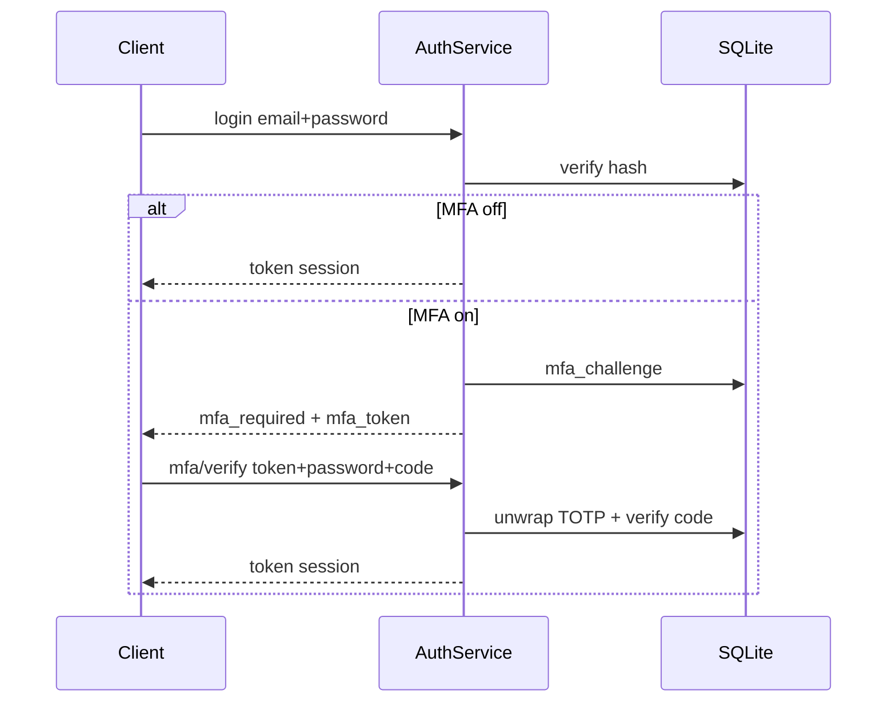
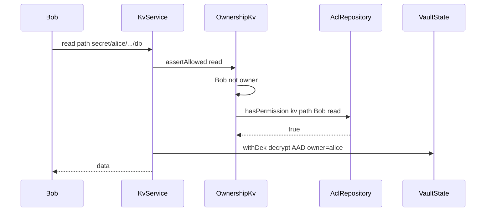
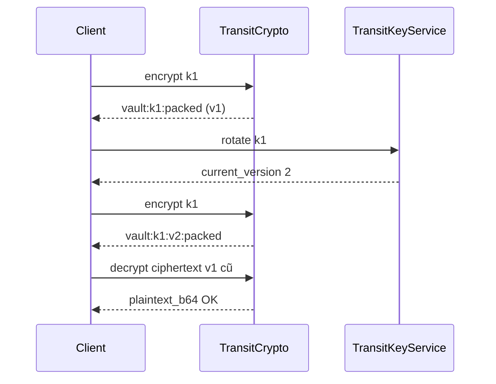
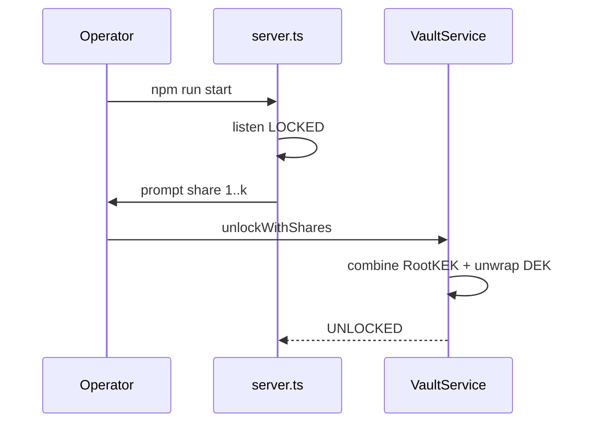

# API và luồng điển hình

Base URL mặc định: `http://127.0.0.1:3000`  
Auth: header `Authorization: Bearer <token>` khi ghi “Bearer”.

Lỗi thống nhất:

```json
{ "error": { "code": "VAULT_LOCKED", "message": "..." } }
```

---

## Bảng API

### Vault & Auth

| Method | Path | Auth | Vault | Mô tả |
|--------|------|------|-------|-------|
| GET | `/v1/vault/status` | Không | — | `{ status: "LOCKED"\|"UNLOCKED" }` |
| POST | `/v1/auth/register` | Không | Không cần | `{ email, passphrase, confirm_passphrase }` |
| POST | `/v1/auth/login` | Không | Không cần | Session **hoặc** `{ mfa_required, mfa_token, email }` |
| POST | `/v1/auth/mfa/verify` | Không | Không cần | `{ mfa_token, passphrase, code }` → session |
| POST | `/v1/auth/mfa/setup` | Bearer | Không cần | `{ otpauth_url, secret_base32 }` |
| POST | `/v1/auth/mfa/enable` | Bearer | Không cần | `{ passphrase, code }` |
| POST | `/v1/auth/mfa/disable` | Bearer | Không cần | `{ passphrase, code }` |
| POST | `/v1/auth/logout` | Bearer | Không cần | Revoke session |
| GET | `/v1/audit/verify` | Bearer | Không cần | `{ ok, checked, brokenAtId? }` |

### KV

| Method | Path | Auth | Vault | Body chính |
|--------|------|------|-------|------------|
| POST | `/v1/kv/write` | Bearer | UNLOCKED | `{ path, data }` |
| POST | `/v1/kv/read` | Bearer | UNLOCKED | `{ path, version? }` |
| POST | `/v1/kv/read-version` | Bearer | UNLOCKED | `{ path, version }` |
| POST | `/v1/kv/versions` | Bearer | UNLOCKED | `{ path }` → list metadata |
| POST | `/v1/kv/delete` | Bearer | UNLOCKED | `{ path }` |

Path phải dạng `secret/<lowercase-email>/...`.

### Transit

| Method | Path | Auth | Vault | Ghi chú |
|--------|------|------|-------|---------|
| POST | `/v1/transit/keys/encryption` | Bearer | UNLOCKED | `{ key_name }` |
| POST | `/v1/transit/keys/signing` | Bearer | UNLOCKED | `{ key_name, allow_public_verify? }` |
| GET | `/v1/transit/keys` | Bearer | UNLOCKED | List của owner |
| DELETE | `/v1/transit/keys/:keyName` | Bearer | UNLOCKED | Revoke |
| POST | `/v1/transit/keys/:keyName/rotate` | Bearer | UNLOCKED | Owner only |
| POST | `/v1/transit/encrypt/:keyName` | Bearer | UNLOCKED | `{ plaintext_b64 }` |
| POST | `/v1/transit/decrypt` | Bearer | UNLOCKED | `{ ciphertext }` |
| POST | `/v1/transit/sign/:keyName` | Bearer | UNLOCKED | `{ message_b64, message_type }` |
| POST | `/v1/transit/verify/:keyName` | Bearer | UNLOCKED | + `signature_b64`, optional `key_version` |

### ACL

| Method | Path | Auth | Body / query |
|--------|------|------|--------------|
| POST | `/v1/acl/grant` | Bearer (owner) | `resource_type`, `resource_id`, `grantee_email`, `permissions[]` |
| POST | `/v1/acl/revoke` | Bearer (owner) | `resource_type`, `resource_id`, `grantee_email` |
| GET | `/v1/acl/list` | Bearer (owner) | `?resource_type=&resource_id=` |

---

## Sequence: Login + MFA (vault có thể LOCKED)



---

## Sequence: KV write / read (grantee)



AAD luôn neo **alice** (owner path), không neo Bob.

---

## Sequence: Encrypt → rotate → decrypt cũ



---

## Sequence: Start + Shamir unlock



Passphrase mode tương tự nhưng `requestPassphrase` thay vì shares.

---

## CLI liên quan API

| Script | Tương đương / mục đích |
|--------|------------------------|
| `npm run vault:init` | Init passphrase (không qua HTTP) |
| `npm run vault:init:shamir` | Init Shamir + in shares |
| `npm run vault:status` | Đĩa: NOT_INITIALIZED \| LOCKED |
| `npm run audit:verify` | Giống verify chain trên DB file |
| `npm run demo` / `demo:advanced` | Gọi HTTP/services minh họa |
