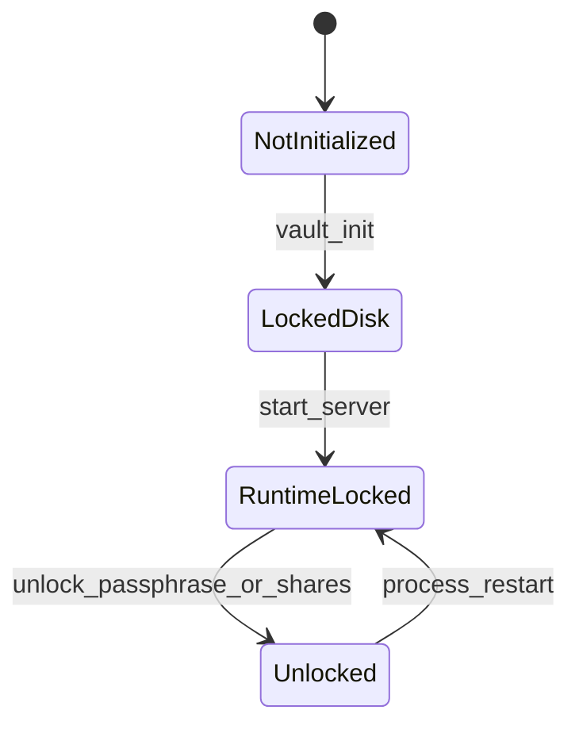
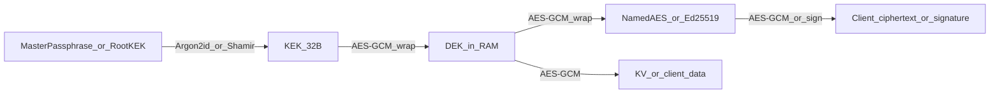

# Kiến trúc Mini Vault

## 1. Các lớp (layers)

```text
┌─────────────────────────────────────────────────────────┐
│  CLI                    HTTP                            │
│  vault:init / status    server.ts → Fastify routes      │
│  vault:init:shamir      (app.ts)                        │
│  audit:verify                                           │
└────────────┬─────────────────────┬──────────────────────┘
             │                     │
             ▼                     ▼
┌─────────────────────────────────────────────────────────┐
│  bootstrap.ts — Dependency Injection                    │
│  tạo services + AuthZ (ownership | placeholder)         │
└────────────────────────────┬────────────────────────────┘
                             │
     ┌───────────┬───────────┼───────────┬──────────┐
     ▼           ▼           ▼           ▼          ▼
 VaultService  AuthService  KvService  Transit*   AclService
 AuditService                                              │
     │           │           │           │          │
     └───────────┴───────────┴───────────┴──────────┘
                             │
              crypto/*  +  repositories  +  SQLite
```

| Layer | Vai trò | File tiêu biểu |
|-------|---------|----------------|
| CLI | Init/status/verify ngoài HTTP | `vault.cli-*.ts`, `audit.cli-verify.ts` |
| HTTP | Parse request, map lỗi, gọi service | `server.ts`, `app.ts` |
| DI | Ghép phụ thuộc | `bootstrap.ts` |
| Domain services | Nghiệp vụ + thứ tự bảo mật | `*.service.ts` |
| Authorization ports | Quyết định được phép hay không | `ownership-*-authorization.ts`, `acl/` |
| Crypto | Nguyên thủy mật mã | `src/crypto/*` |
| Storage | Schema + SQL | `database.ts`, `*.repository.ts` |

## 2. State machine Vault

### Quan sát qua CLI (`npm run vault:status`)

```text
NOT_INITIALIZED  →  (vault:init)  →  LOCKED  (trên đĩa)
```

CLI **không biết** DEK có trong RAM server hay không → không bao giờ trả `UNLOCKED`.

### Quan sát qua HTTP (`GET /v1/vault/status`)

```text
LOCKED  ←→  UNLOCKED
```

Chỉ tồn tại sau khi đã init và `npm run start` đang chạy.



**Unlock cùng process:** `server.ts` listen trước → vòng lặp stdin (passphrase hoặc Shamir shares) gọi `VaultService.unlock*` → `VaultState.setDek(dek)`.

## 3. Pipeline bảo mật Feature 1 / 2

Mọi route KV/Transit (trừ status/auth công khai) tuân thủ:

```text
1. Bearer token → AuthService.authenticate
2. Session còn hạn, chưa revoke
3. VaultState.isUnlocked() — nếu không → VAULT_LOCKED
4. Authorization (ownership ± ACL grant)
5. Business + crypto (DEK / named key)
6. Response (không lộ key material)
```

Thứ tự lỗi điển hình: `UNAUTHENTICATED` / `SESSION_EXPIRED` → `VAULT_LOCKED` → `PERMISSION_DENIED` → lỗi nghiệp vụ.

## 4. DEK và mã hóa lồng nhau



- **Passphrase mode:** Argon2id(passphrase, salt) → KEK → wrap DEK.
- **Shamir mode:** RootKEK ngẫu nhiên → wrap DEK; RootKEK chia thành N shares (cần K để mở).

## 5. Hai engine

### KV Engine

- Path chuẩn: `secret/<email>/...` (canonical, không rewrite).
- Payload JSON mã hóa bằng DEK; AAD gắn **owner + path + version**.
- Ownership mặc định; có thể share qua `access_grants`.

### Transit Engine

- Named key `ENCRYPT_DECRYPT` (AES-256) hoặc `SIGN_VERIFY` (Ed25519).
- Key material bọc bằng DEK; client chỉ nhận ciphertext / signature.
- Envelope encrypt: `vault:<key_name>:<b64>` (v1) hoặc `vault:<key_name>:v<N>:<b64>` (sau rotate).

## 6. Config môi trường (không chứa secret vault)

Từ [`src/config/env.ts`](../src/config/env.ts):

| Biến | Mặc định | Ý nghĩa |
|------|----------|---------|
| `PORT` | `3000` | Cổng HTTP |
| `HOST` | `127.0.0.1` | Bind address |
| `DATABASE_PATH` | `data/vault.db` | Đường dẫn SQLite |
| `AUTHZ_MODE` | `ownership` | `placeholder` = fail-closed (test) |

**Không** đặt Master Passphrase vào env.

## 7. Liên kết với các tài liệu khác

- Chi tiết file: [modules.md](./modules.md)
- Feature bắt buộc / bonus: [features-required.md](./features-required.md), [features-advanced.md](./features-advanced.md)
- API + sequence: [api-flows.md](./api-flows.md)
