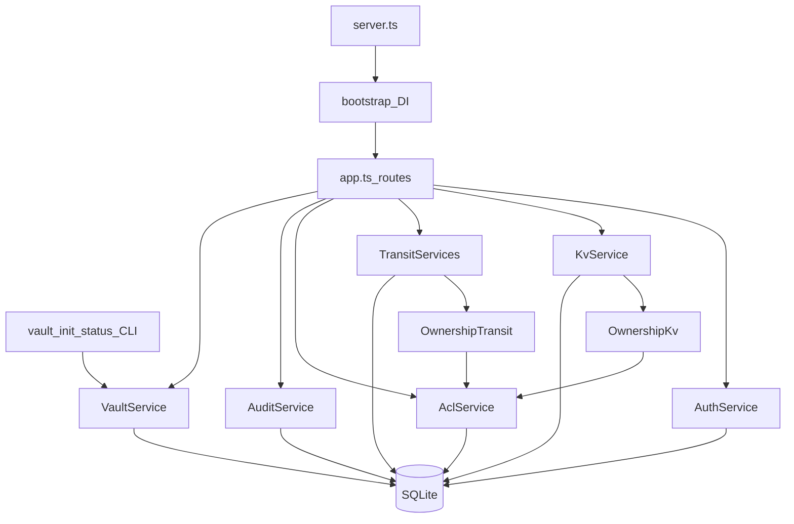

# Mini Vault — Tài liệu hướng dẫn

**Nhóm:** 23127177, 23127200  
**Môn:** Computer Security — Assignment 1  
**Nguồn yêu cầu:** `Crypt_proj1.pdf`

Tài liệu này giải thích **cấu trúc, chức năng, file chính, cách hoạt động và liên kết** của ứng dụng Mini Vault (KV Engine + Transit Engine). Dùng để đọc code, làm report và demo.

## Mục lục

| Tài liệu | Nội dung |
|----------|----------|
| [architecture.md](./architecture.md) | Layer, state machine Vault, pipeline bảo mật, sơ đồ liên kết |
| [modules.md](./modules.md) | Cây thư mục và giải thích từng module/file |
| [features-required.md](./features-required.md) | 8 mục bắt buộc §III (0.1–2.4) |
| [features-advanced.md](./features-advanced.md) | 7 mục mở rộng §IV (extra credit) |
| [api-flows.md](./api-flows.md) | Bảng API đầy đủ + sequence điển hình |
| [runbook.md](./runbook.md) | Cài đặt, chạy, test, reset DB, troubleshooting |

Quickstart ngắn: xem [`../README.md`](../README.md).

> Ghi chú: bản thiết kế gốc (nếu còn) nằm ngoài repo tại `../docs/FINAL_PLAN.md`. **Chi tiết runtime và cấu trúc hiện tại** lấy theo bộ `docs/` này.

---

## Mini Vault giải quyết gì?

1. **KV Engine** — Lưu secret trên đĩa luôn là ciphertext; chỉ chủ (hoặc người được grant) được đọc/ghi/xóa.
2. **Transit Engine** — Mã hóa / giải mã / ký số **không** trả key material cho client; key nằm trên server, bọc bằng DEK.

## Sơ đồ liên kết cao cấp

## Nguyên tắc bảo mật cốt lõi

- **DEK** (Data Encryption Key) chỉ tồn tại trong RAM process Fastify sau unlock; không ghi plaintext DEK lên đĩa.
- **Master Passphrase / Shamir shares** chỉ nhập qua stdin (không argv / env / `.env`).
- Server **listen khi LOCKED**; Feature 1/2 từ chối với `VAULT_LOCKED` cho đến khi unlock.
- Pipeline Feature 1/2: **Auth → session hợp lệ → Vault UNLOCKED → Authorization → crypto**.
- Audit chỉ ghi field allowlist (không token, không passphrase, không plaintext secret).

## Stack

| Thành phần | Công nghệ |
|------------|-----------|
| Runtime | Node.js ≥ 20 + TypeScript |
| HTTP | Fastify |
| DB | SQLite (`better-sqlite3`, WAL) |
| KDF / password | Argon2id |
| AEAD | AES-256-GCM (`node:crypto`) |
| Signing | Ed25519 (`node:crypto`) |
